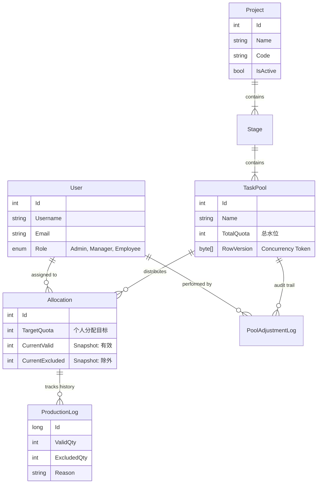

# FluxQuant Domain Design & Schema

## 1. Entity Relationship Diagram (ERD)



## 2. Detailed C# Entity Models

### 2.1 Core Kernel (`User`, `Project`, `Stage`)

```csharp
public class User
{
    public int Id { get; set; }
    public required string Username { get; set; }
    public required string Email { get; set; }
    public UserRole Role { get; set; } // Enum: Manager, Employee
    
    // Navigations
    public ICollection<Allocation> Allocations { get; set; } = [];
}

public class Project
{
    public int Id { get; set; }
    public required string Name { get; set; }
    public required string Code { get; set; } // e.g., "2026-Q1"
    public bool IsActive { get; set; } = true;
    
    public ICollection<Stage> Stages { get; set; } = [];
}

public class Stage
{
    public int Id { get; set; }
    public int ProjectId { get; set; }
    public required string Name { get; set; } // e.g., "Data Cleaning"
    public int Order { get; set; } // Sorting order
    
    public Project Project { get; set; } = null!;
    public ICollection<TaskPool> TaskPools { get; set; } = [];
}
```

### 2.2 The Flow Engine (`TaskPool`, `Allocation`)

```csharp
public class TaskPool
{
    public int Id { get; set; }
    public int StageId { get; set; }
    public required string Name { get; set; } // e.g., "Contract Scanning"
    
    /// <summary>
    /// The global denominator.
    /// Changing this MUST create a PoolAdjustmentLog.
    /// </summary>
    public int TotalQuota { get; set; } 
    
    /// <summary>
    /// Optimistic Concurrency Token
    /// </summary>
    [Timestamp]
    public byte[] RowVersion { get; set; } = [];

    public Stage Stage { get; set; } = null!;
    public ICollection<Allocation> Allocations { get; set; } = [];
    public ICollection<PoolAdjustmentLog> AdjustmentLogs { get; set; } = [];
}

public class Allocation
{
    public int Id { get; set; }
    public int TaskPoolId { get; set; }
    public int UserId { get; set; }
    
    public int TargetQuota { get; set; } // 0 means unassigned or infinite? Usually fixed.
    
    // --- SNAPSHOT FIELDS (Updated via Transactions) ---
    public int CurrentValid { get; set; }
    public int CurrentExcluded { get; set; }

    public TaskPool TaskPool { get; set; } = null!;
    public User User { get; set; } = null!;
    public ICollection<ProductionLog> Logs { get; set; } = [];
}
```

### 2.3 The Trace (`Logs`)

```csharp
public class ProductionLog
{
    public long Id { get; set; } // BigInt for massive logs
    public int AllocationId { get; set; }
    
    public DateTime LogDate { get; set; } // The business date (e.g. "Work for 2026-01-17")
    public DateTime CreatedAt { get; set; } // System timestamp
    
    public int ValidQty { get; set; }
    public int ExcludedQty { get; set; }
    
    /// <summary>
    /// Required if ExcludedQty > 0
    /// </summary>
    public string? ExclusionReason { get; set; } 
    public string? Comment { get; set; }

    public Allocation Allocation { get; set; } = null!;
}

public class PoolAdjustmentLog
{
    public int Id { get; set; }
    public int TaskPoolId { get; set; }
    public int OperatorUserId { get; set; }
    
    public int OldQuota { get; set; }
    public int NewQuota { get; set; }
    public required string Reason { get; set; }
    public DateTime CreatedAt { get; set; }

    public TaskPool TaskPool { get; set; } = null!;
    public User Operator { get; set; } = null!;
}
```

## 3. Critical Implementation Rules

1.  **Transaction Policy**:
    *   Any write to `ProductionLog` **MUST** be wrapped in a transaction that also updates `Allocation.CurrentValid` / `Allocation.CurrentExcluded`.
    *   *Why?* To guarantee the Snapshot is always eventually consistent with the logs.

2.  **Concurrency**:
    *   `TaskPool` modification uses `RowVersion`. If a Manager tries to update Quota while another just did, EF Core throws `DbUpdateConcurrencyException`.

3.  **Validation**:
    *   `ExcludedQty > 0` implies `ExclusionReason != null`. This should be enforced in the Domain Layer or Fluent Validation, not just DB constraints.
